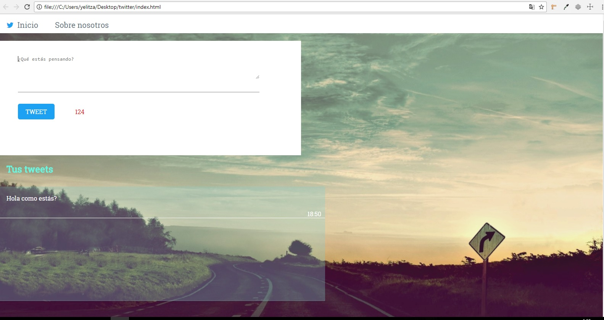

# Proyecto Twitter

## Descripción:

El siguiente repositorio contiene la realización del proyecto "Twitter", que consiste en la replicación de sus funcionalidades básicas, por medio de una estructura semántica de html, aplicación de estilo con css y el desarrollo de funcionalidades con Javascript.

### Herramientas utilizadas:

1. HTML5

2. CSS3

3. JS

### Pseudocódigo:

1.	FUNCION (event)
2.	  Load  window;
3.    Definir textArea = document.getElementById('input');
4.    Definir textContainer = document.getElementById('container');
5.    Definir button = document.getElementById('tweet');
6.    Definir section = document.getElementsByTagName('section');
7.    Definir form = document.getElementsByTagName('form');
8.    Definir maxLength = textArea.getAttribute('maxlength');
9.    Definir count = document.getElementById('count');
10.   Definir number = maxLength - textArea.value.length;
11.	FIN FUNCION

12.	FUNCION saveText(event)
13.	  SI (textArea.value) ENTONCES
14.     Definir paragraph = document.createElement('p');
15.     Definir paragraph.textContent = textArea.value;
16.     textContainer.appendChild(paragraph);
17.     textContainer.classList.add('container-text');
18.     paragraph.classList.add('text');
19.     Definir textArea.value = '';
20.   FIN SI
21. FIN FUNCION

 
22.	FUNCION enabled(event)
23.	   Si (textArea.value)  ENTONCES
24.	      button.disabled = false;
25.       button.classList.add('button-enabled');
26.	   FIN SI
27.	FIN FUNCION

28.	FUNCION accountantText(event)
29.   Definir button.disabled = false;
30.   Definir button.classList.add('button-enabled');
31. FIN FUNCION

32. FUNCION changeColor(event)
33.   Definir number = maxLength - textArea.value.length;
34.   SI (number > parseInt(130) && number < parseInt(141)) ENTONCES
35.     count.classList.add('blue');
36.   DE LO CONTRARIO SI (number > parseInt(120) && number < parseInt(130)) ENTONCES
37.     count.classList.remove('orange')
38.     count.classList.add('red');
39.   DE LO CONTRARIO SI (number <= parseInt(120) && number > parseInt(0)) ENTONCES
40.     count.classList.add('black');
41.   FIN SI
42. FIN FUNCION

43. FUNCION time(event)
44.   Definir date = new Date();
45.   Definir strDate = date.getHours() + ':' + date.getMinutes();
46.   Definir timeContainer = document.createElement('div');
47.   Definir timeContent = document.createElement('p');
48.   timeContent.textContent = strDate;
49.   timeContainer.appendChild(timeContent);
50.   container.appendChild(timeContainer);
51.   timeContent.classList.add('time-text');
52.   timeContainer.classList.add('time'); 
53. FIN FUNCION

### Diagrama de flujo

https://go.gliffy.com/go/share/image/sy2a8ndhu7apyt7pf9uv.png?utm_medium=live-embed&utm_source=custom